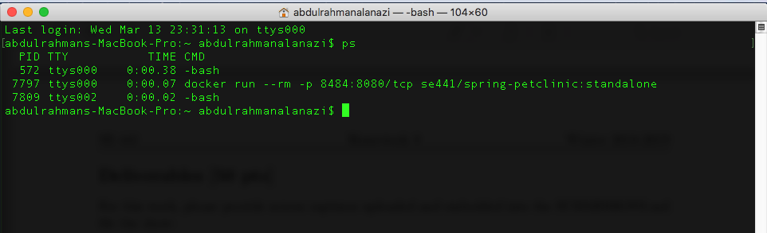
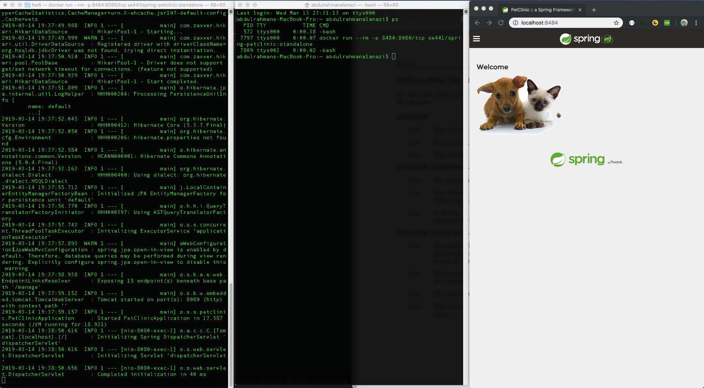
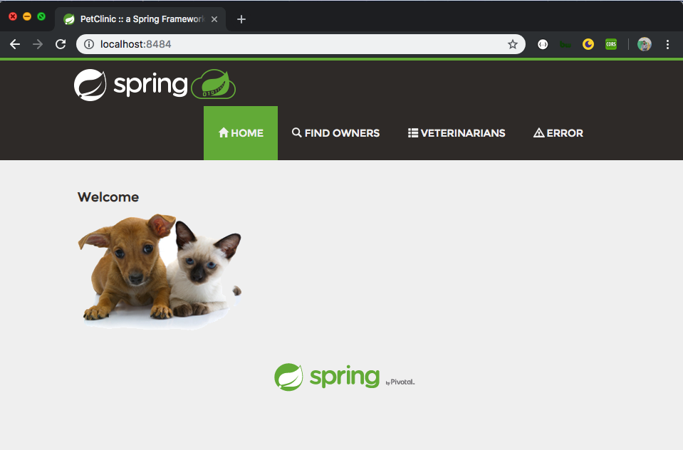
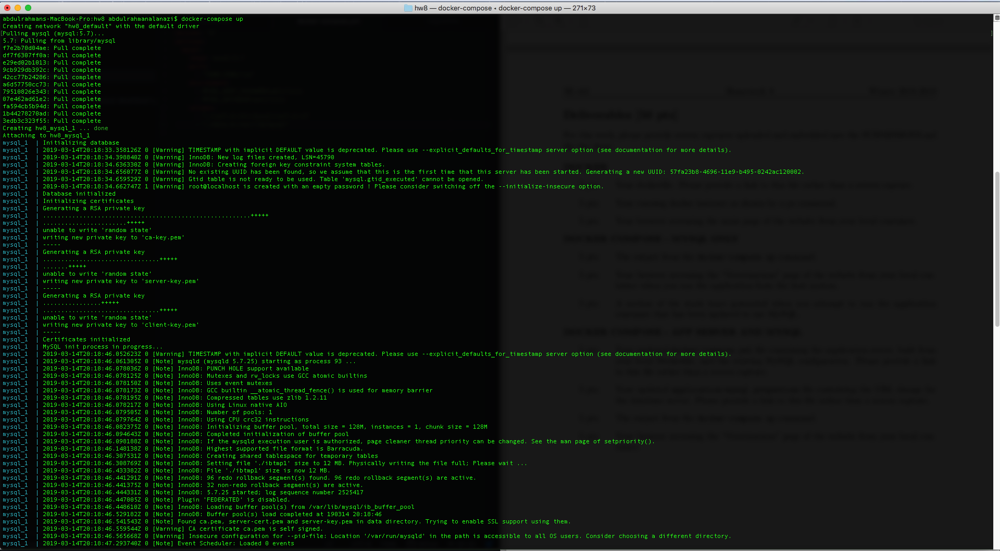
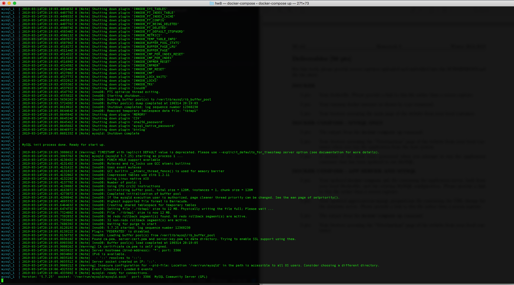
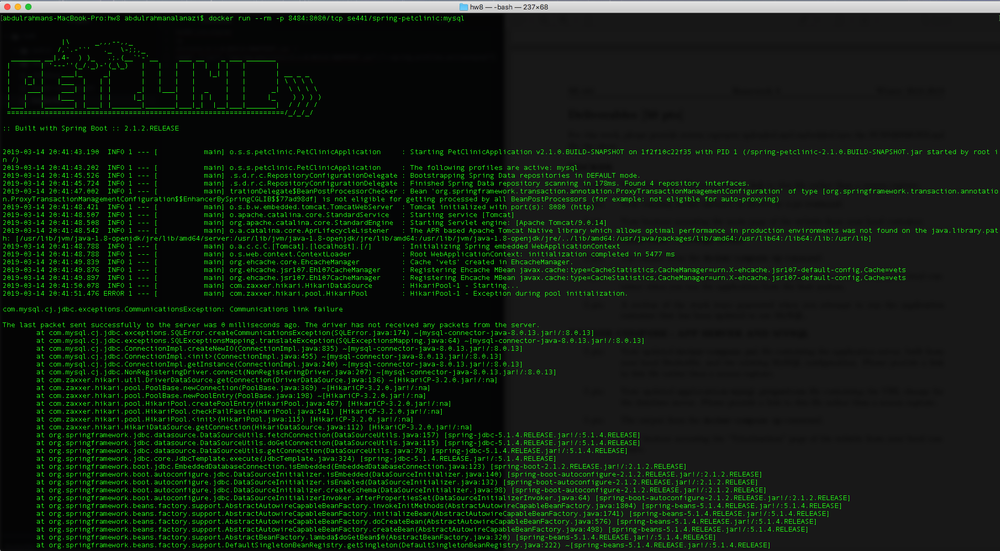
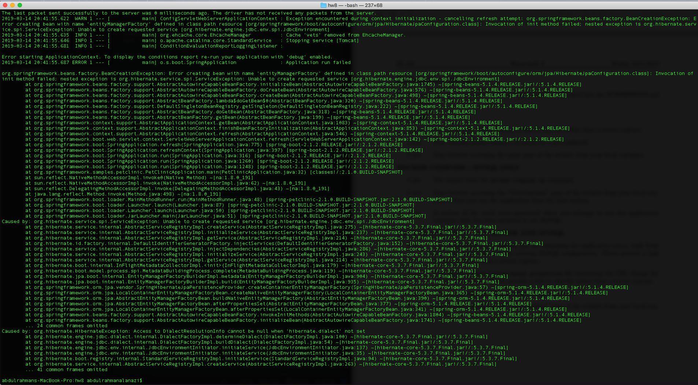
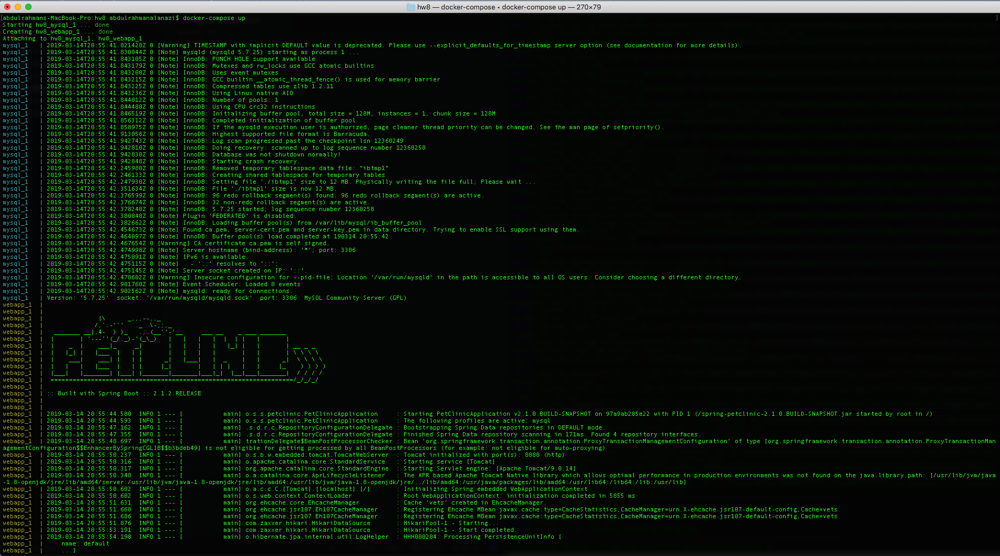
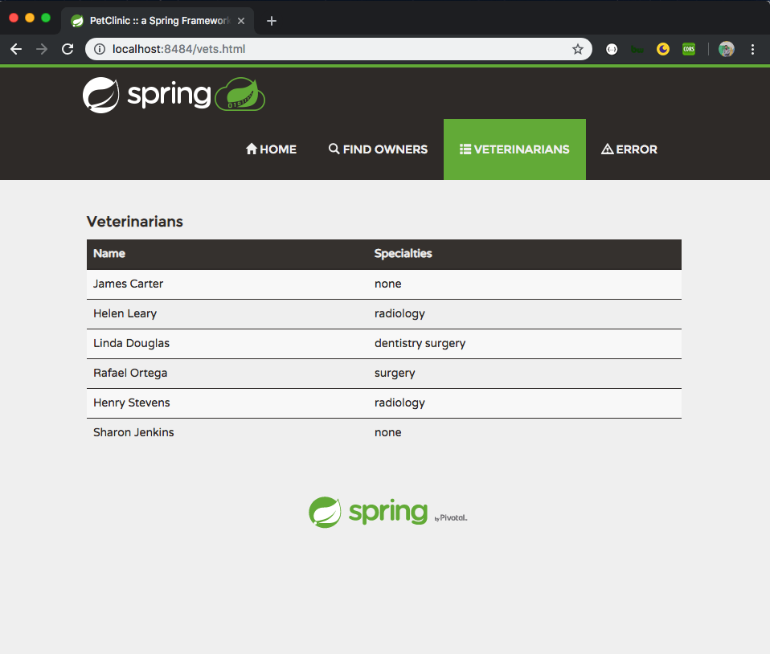

# HW8
 ## Abdulrahman Alanazi 1536969

##DOCKER

1- Your dockerfile. Please provide a link to this file rather than a screen capture.

[Dockerfile](hw8/Dockerfile)

2- Your running docker instance as shown by a ps command.

3- Your browser accessing the main page of the website from your local container.

##DOCKER

4- The output from the docker-compose up command.

5- Your browser accessing the “Veterinarians” page of the website from your local con-
tainer when you run the application from the host system.

6- A section of the stack trace generated when you attempt to run the application container that has been updated to use MySQL.

##DOCKER

7- Your updated docker-compose.yml file containing the application server, built from your local Dockerfile, and the existing MySQL configuration. Please provide a link to this file rather than a screen capture.

[docker-compose](hw8/docker-compose.yml)

8- Your updated application-mysql.properties file containing the URL change for the database server. Please provide a link to this file rather than a screen capture.

[properties file](src/main/resources/application-mysql.properties)

9- The output from the docker-compose up command.

10- Your browser accessing the “Veterinarians” page of the website from your local con- tainer.

