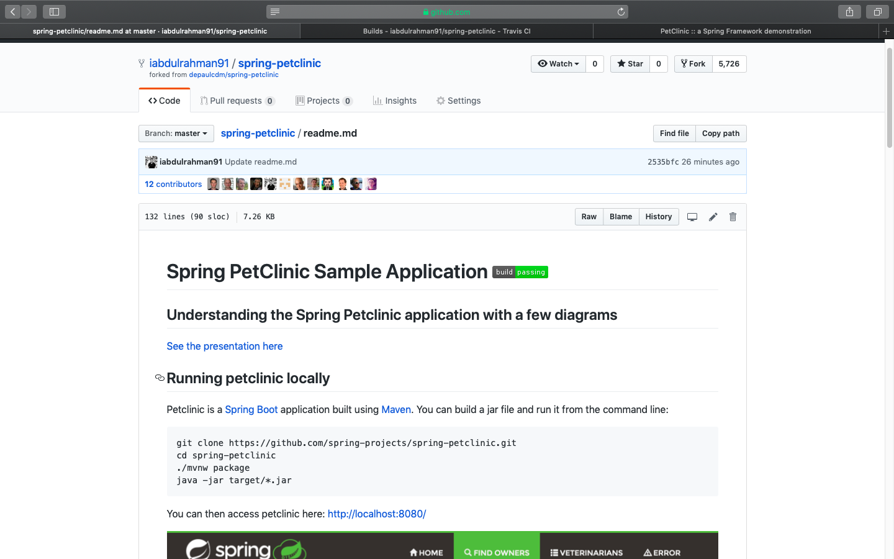

# Images in order
 ## Abdulrahman Alanazi 1536969

 - Images folder [images](images).

1- Your Github account showing that is has been forked from the depaulcdm/spring-
petclinic repository.

2- Your Travis CI dashboard showing a successful first build.

3- The section of the POM file showing the coordinates after you’ve changed them.

4-Your Travis CI dashboard showing a successful build after your change of the group ID.

5- The section of the POM file showing the coordinates after you’ve commented them out.

6- Your Travis CI dashboard showing the unsuccessful build after the breaking change.

7- Your Github repository with the readme.md file selected showing the build failed status after the Travis CI build fails.

8- The section of the POM file showing the coordinates after you’ve fixed them.

9- Your Travis CI dashboard showing the successful build after the breaking change has been fixed.

10- Your Github repository with the readme.md file selected showing the build success status after the Travis CI build has recovered.

